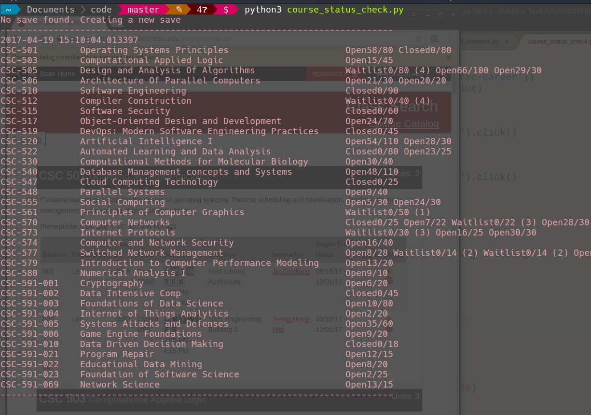

# Web scraping in Python
Using BeautifulSoup, Selenium to do web scraping and parsing.  
More ideas/links in [Projects](projects.md)

## Bookmyshow movie listing
- Display list of movie shows from bookmyshow.com

  

## Codechef contest listing

- Display ongoing/upcoming programming contests from codechef.com

  

## NCSU course listing 

- Display seats/vacancy status of NCSU Courses

- Using selenium and chrome web browser.

  

